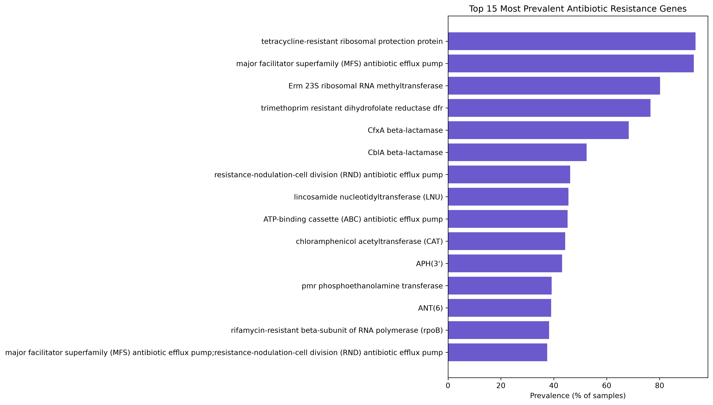
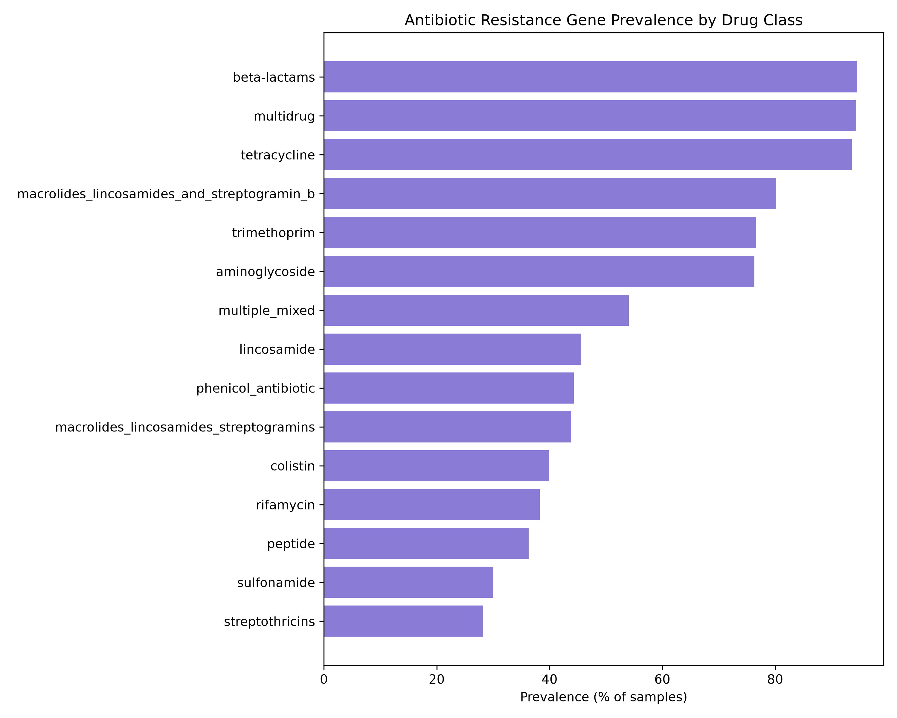
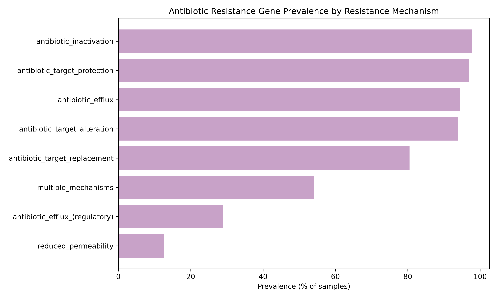
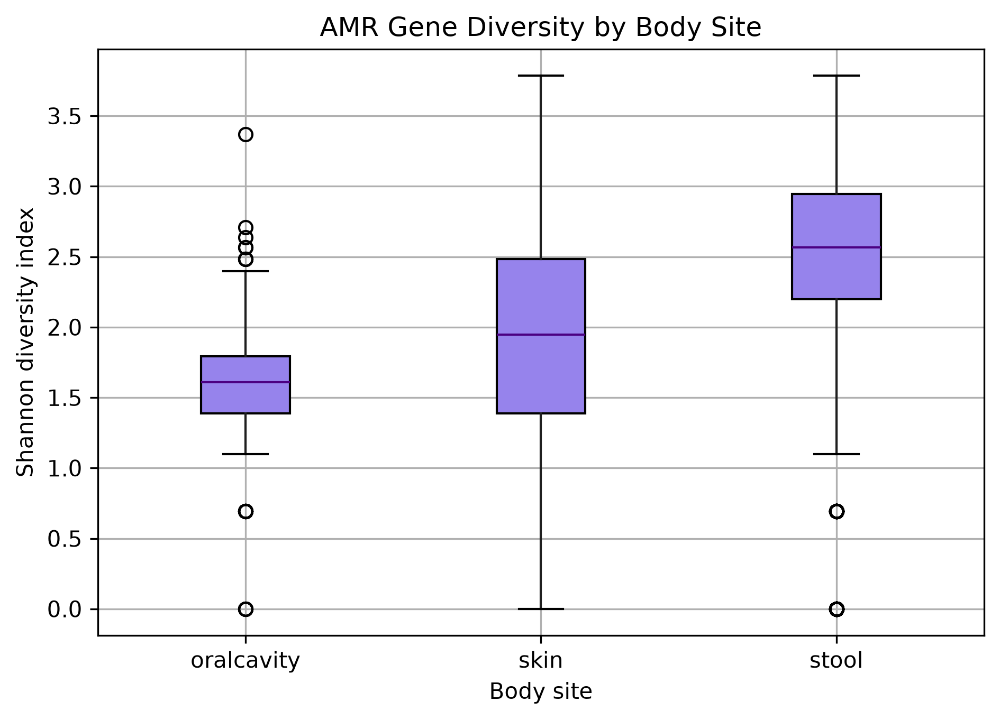
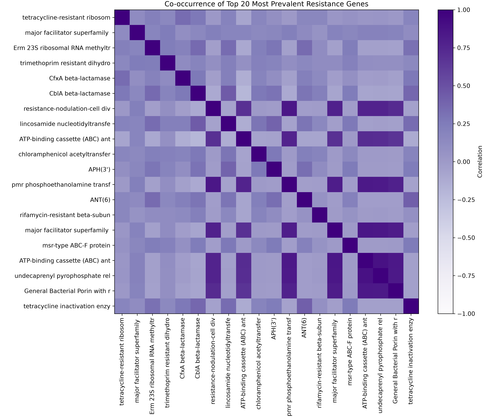

# Global Gut Microbiome Antibiotic Resistance Gene Analysis

Exploratory analysis of antibiotic resistance gene (ARG) prevalence, classification, diversity and co-occurrence across 14,738 human microbiome samples from 33 countries, using data adapted from Brito Lab (Cornell University), published in *Nature Communications*.

## Research question

Which antibiotic resistance genes, drug classes and resistance mechanisms are most prevalent across the global human microbiome, and how does resistance gene diversity vary by body site?

## Data source

Data derived from supplementary materials of:

> Diebold, P.J., Rhee, M.W., Shi, Q. et al. "Clinically relevant antibiotic resistance genes are linked to a limited set of taxa within gut microbiome worldwide", *Nature Communications* (2023). https://doi.org/10.1038/s41467-023-42998-6

Specifically:
- **Supplementary Data 3** - sample-level ARG presence/absence matrix (14,738 samples x 138 gene families), with associated metadata (body site, country, continent)
- **Supplementary Data 6** - reference table mapping gene families to antibiotic drug classes and resistance mechanisms

Gene classifications not present in the reference table were manually cross-referenced against the [Comprehensive Antibiotic Resistance Database (CARD)](https://card.mcmaster.ca/): Alcock et al., "CARD 2023: expanded curation, support for machine learning, and resistome prediction at the Comprehensive Antibiotic Resistance Database", *Nucleic Acids Research*, 2023.

## Methods summary

1. Loaded and cleaned raw supplementary data (resolved formatting inconsistencies, whitespace/typo errors, and a data entry shift affecting one gene record, see notebook for full documentation)
2. Classified all 138 gene families along two independent axes: **drug class** (which antibiotic resistance targets) and **resistance mechanism** (how resistance is achieved), by combining exact matches from the reference table, individually CARD-verified edge cases, and keyword-based classification for the remainder
3. Computed gene, drug-class, and mechanism-level prevalence across all samples
4. Calculated per-sample Shannon diversity index across all 138 genes
5. Investigated diversity patterns by body site
6. Computed pairwise co-occurrence (correlation) among the 20 most prevalent genes

**Tools:** Python, pandas, numpy, matplotlib

## Key findings

### 1. A small set of broad-spectrum mechanisms dominate globally

The most prevalent individual genes - tetracycline-resistant ribosomal protection proteins (93.6%) and MFS efflux pumps (92.9%), reflect resistance mechanisms with low metabolic cost, widespread across gut commensal bacteria regardless of direct recent antibiotic exposure, likely shaped by decades of historical antibiotic use in medicine and agriculture. 



By drug class, resistance to beta-lactams, tetracyclines, and general multidrug efflux each exceeds 90% sample prevalence, while resistance to more clinically reserved drug classes (glycopeptides, quinolones) is far rarer.



By mechanism, antibiotic inactivation (enzymatic breakdown) and target protection/alteration are the most prevalent strategies (93-98%), while reduced permeability, which is a comparatively weaker, supplementary mechanism, is far less common (12.7%).



### 2. Resistance gene diversity varies substantially by body site

Overall Shannon diversity averaged 2.52 (of a theoretical maximum ~4.93), but this masks a clear body site effect. Stool samples show the highest, most consistent diversity (median ~2.6). Oral cavity samples show substantially lower diversity (median ~1.6), and skin samples are intermediate on average (median ~1.9) but show the widest variability of any site.



Quantifying this: 60.5% of oral cavity samples and 37.9% of skin samples fall into a low diversity group (Shannon index below 1.7), compared to just 7.2% of stool samples. This likely reflects genuine compositional differences between gut, oral, and skin microbiomes, though it may also partly reflect reference database detection bias toward gut-associated taxa, since gut AMR surveillance has historically received the most research attention. This dataset alone cannot fully separate the two explanations.

### 3. Membrane-associated resistance genes cluster together

Among the 20 most prevalent genes, a distinct cluster of strongly co-occurring genes emerges: resistance-nodulation-cell division (RND) efflux pumps, ABC transporters, phosphoethanolamine transferase, undecaprenyl pyrophosphate-related proteins, and porin-related genes all show elevated positive correlation with one another, possibly resulting from shared selection pressure on cell-envelope mediated antibiotic defence. Most other gene pairs show correlation near zero, indicating largely independent presence.



## Limitations

- This analysis reflects gene **presence/absence** only, not expression, copy number, or measured phenotypic resistance.
- Roughly 40% of gene names lacked pre-existing classification in the provided reference table. These were classified using a combination of individual verification against CARD (for ambiguous/high-uncertainty cases) and keyword-based rules (for names following consistent, well-established naming patterns). While validated wherever practical, this introduces some risk of misclassification for edge cases not individually checked.
- Lower diversity at oral and skin sites could partly reflect genuine biology and partly due to reference database bias toward gut-associated taxa, this dataset cannot entirely distinguish between the two explanations (see Finding 2).

## Repository structure

```
amr-resistome-project/
├── data/
│   └── raw/            # original, unedited supplementary files
├── notebooks/
│   └── 01_data_exploration.ipynb
├── figures/            # all exported chart images
└── README.md
```

## Author

Amulya Carmel Pinto - [LinkedIn](https://www.linkedin.com/in/amulya-pinto-2509)
